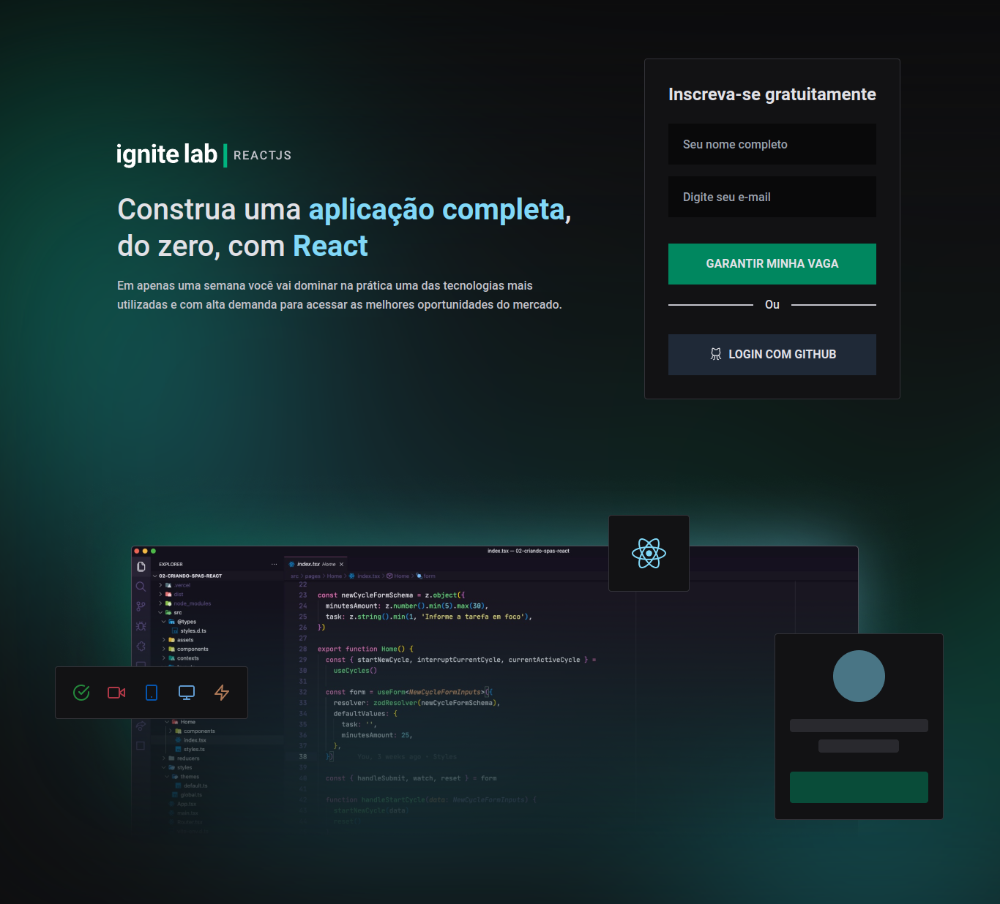

<h1>
    
</h1>

<h1>
    
</h1>

### 🧾 Sobre

<p>Esse projeto foi desenvolvido durante o ignite-lab-react, da <a href="https://www.rocketseat.com.br/" title="Rocketseat" target="_blank">Rocketseat</a>. O projeto é uma plataforma de cursos, onde há a programação para sair determinado vídeo do curso.</p>

---

### 🚀 Tecnologias utilizadas

-   React
-   TypeScript
-   TailwindCss
-   ClassNames
-   Date-fns
-   Firebase
-   GraphQL
-   Phosphor-react
-   React-hook-form
-   Yup
-   React-lottie

---

### 〽️ Getting started

```zsh
    # Clonando o repositório em sua máquina
    $ git clone https://github.com/edsonjaguiar/ignite-lab-react

    # Acessando o repositório
    $ cd ignite-lab-react

    # Instalando as dependências
    $ yarn

    # Iniciando o server
    $ yarn dev
```
